# MDS DPS Transactional Data Outbound API — Technical Documentation

## 1. Overview

This API provides transactional market data access for:
- **Timeseries**
- **Curves**
- **Surfaces**
- **Metadata / Metadata Range**
- **Data Trace**
- **MESAP transition paths**
- **Synchronous and streaming responses**

Target runtime: **.NET 8**.

---

## 2. Solution Structure (high level)

```text
API
 ├─ Endpoint mapping (Minimal APIs)
 ├─ Middleware, validation, authorization, telemetry
 └─ DTO contracts

Service
 ├─ Handlers (MdoHandler, GenericHandler, MetadataHandler, DataTraceHandler)
 ├─ Orchestration (TransactionalDataService, TransactionalDataCsvService)
 ├─ Strategy selection (MdoDataFetchingStrategyParser)
 └─ Mapping/translation and caching orchestration

Domain
 ├─ Entities, filters, parsers, expressions
 └─ Repository interfaces and shared abstractions

Infrastructure
 ├─ Repository implementations (SQL/Cassandra/MESAP)
 ├─ External API clients
 ├─ Throttling + concurrency gates
 └─ Configuration + resilience policies
```

---

## 3. Runtime Request Pipeline

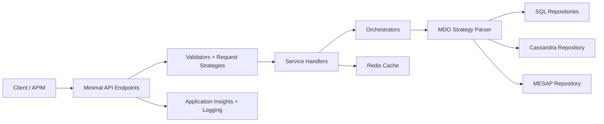

---

## 4. API Endpoint Catalog

Base route:
- `api/v{version:apiVersion}`
- Default version: `v1`

Info endpoint:
- `GET /api/v{version}/info`

Health endpoints:
- `/health/startup`
- `/health/liveness`
- `/health/readiness`

### 4.1 Transactional data endpoints (POST)

Resource groups:
- `curves`
- `timeseries`
- `surfaces`

Route variants:
- `{resource}`
- `design/{resource}`
- `validation/{resource}`
- `productive/{resource}`
- `migration/{resource}`

### 4.2 Transactional stream endpoints (POST)

Route patterns:
- `{resource}/streaming`
- `design/{resource}/streaming`
- `validation/{resource}/streaming`
- `productive/{resource}/streaming`
- `migration/{resource}/streaming`

Supported stream content types:
- `application/x-ndjson`
- `application/json`

### 4.3 Generic CSV endpoints

Synchronous CSV download (POST):
- `generic`
- `design/generic`
- `validation/generic`
- `productive/generic`
- `migration/generic`

Streaming CSV (POST):
- `generic/streaming`
- `design/generic/streaming`
- `validation/generic/streaming`
- `productive/generic/streaming`
- `migration/generic/streaming`

### 4.4 Lite endpoint (GET)

- `lite`
- `design/lite`
- `validation/lite`
- `productive/lite`

### 4.5 Metadata endpoints (POST)

Metadata:
- `{resource}/metadata`
- `design/{resource}/metadata`
- `validation/{resource}/metadata`
- `productive/{resource}/metadata`

Metadata range:
- `{resource}/metadata/range`
- `design/{resource}/metadata/range`
- `validation/{resource}/metadata/range`
- `productive/{resource}/metadata/range`

(`resource` = `curves | timeseries | surfaces`)

### 4.6 Data Trace endpoints (POST)

- `datatrace`
- `design/datatrace`
- `validation/datatrace`
- `productive/datatrace`

### 4.7 MESAP transition endpoints (POST)

MESAP generic:
- `mesaptransition/generic`
- `validation/mesaptransition/generic`
- `productive/mesaptransition/generic`

---

## 5. Request Objects (Contract Layer)

### TransactionalDataRequest[]
- `Ids: List<long>`
- `VersionAsOf: DateTime?`
- `Filters: Filters?`
- `Transformations: Transformations?`
- `Columns: List<string>?`
- `IncludeDeleted: bool?`

### GenericRequest
- `Ids: long[]?` or `Id: long?`
- `MdoIdArray` computed from Ids/Id
- `VersionAsOf`, `Filters`, `Transformations`, `Columns`, `IncludeDeleted`

### LiteRequest (query)
- `id: long`
- `from: string`
- `to: string?`

### MetadataRequest
- `Id: long`
- `ReferenceTime: DateTimeOffset`

### MetadataRangeRequest
- `Ids: long[]`
- `StartTime: DateTimeOffset`
- `EndTime: DateTimeOffset`

### DataTraceRequest
- `Id: long`
- `ReferenceTime: DateTimeOffset`
- `VersionAsOf: DateTimeOffset?`

---

## 6. Object Connections (DI and Runtime)

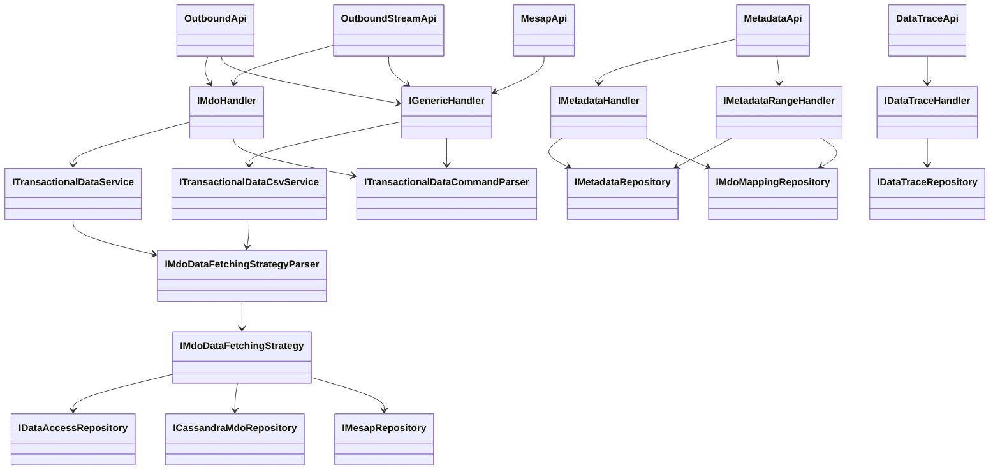

---

## 7. Data Source Strategy Selection

`MdoDataFetchingStrategyParser` chooses strategy using mapping and request context:

Priority:
1. **MESAP strategy** (when mesap endpoint + mapped mesap id)
2. **Hyperscale strategy** (when HyperScaleId exists)
3. **CMDP strategy** when any of:
   - shape requested
   - aggregations requested
   - id belongs to `Hpfc_Ids_To_Cmdp`
   - no Cassandra id
   - timezone rule requires CMDP path
4. **Cassandra strategy** otherwise

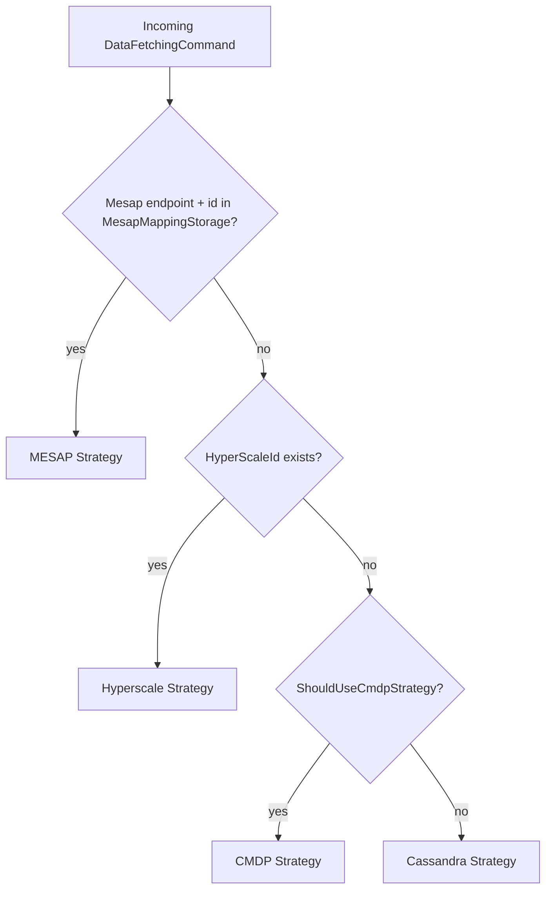

---

## 8. Infrastructure and External Dependencies

### 8.1 SQL connections
- CMDP SQL (`CmdpSqlDatabase`)
- Mapping SQL (`CmdpMappingDatabase`)
- Hyperscale SQL (`MdsDatabase`)
- MESAP mapping SQL (`MesapMappingDatabase`)

### 8.2 Cassandra
- `CassandraSessionFactory`
- `CassandraMdoRepository`
- Prepared statement cache
- Concurrency gate (`CassandraConnectionGate`)

### 8.3 Redis
- `RedisDatabaseProvider` with `TokenCredential`
- Shared for:
  - response cache (`ICacheHandler`)
  - query rate limiting (`ICmdpQueryRateLimiter`)
  - global connection gate (`ICmdpGlobalConnectionGate`)

### 8.4 External HTTP APIs
- License validation API (`ILicenseValidatorApiClient`)
- MESAP API integration (`IMesapRepository` via `MesapDataRepository`)
- Configured resiliency:
  - exponential retry
  - circuit breaker

### 8.5 Observability
- Application Insights telemetry + processors
- SQL dependency enrichment/filtering
- Cassandra telemetry tracker and module
- Correlation and caller enrichers

---

## 9. Main Execution Sequences

### 9.1 Synchronous transactional request

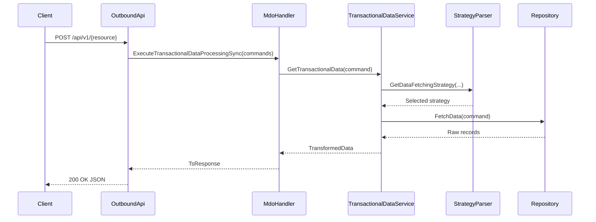

### 9.2 Streaming transactional request

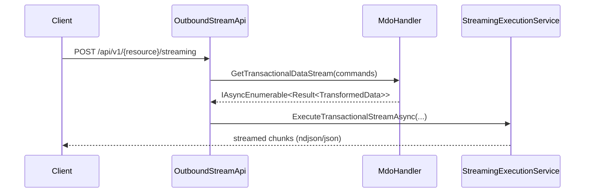

### 9.3 Metadata flow

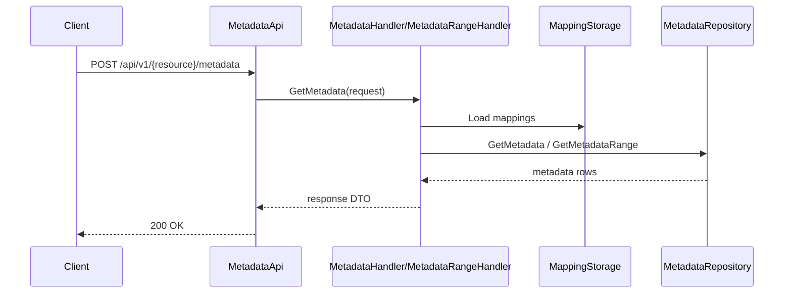

---

## 10. Middleware and Cross-cutting Components

Pipeline includes:
- Global exception handling
- Request tracing middleware
- HTTP logging
- Compression
- Authentication / Authorization
- Custom outbound middlewares (validation/raw/correlation/license)
- Health checks mapping

Validation stack:
1. Request/schema-level checks
2. FluentValidation validators
3. Query validators for lite routes
4. Domain/mapping-aware validation

---

## 11. Configuration Map (major sections)

- `SplitOptions`
- `StreamOptions`
- `ParallelTasksSettings`
- `LimitsSettings`
- `CassandraConfig`
- `CassandraRouting`
- `RedisOptions`
- `AuthorizationApiOptions`
- `MesapApiOptions`
- `CmdpRateLimiterOptions`
- `CmdpGlobalConnectionGateOptions`
- `ApplicationInsights`

---

## 12. Quick Dependency Diagram (projects)

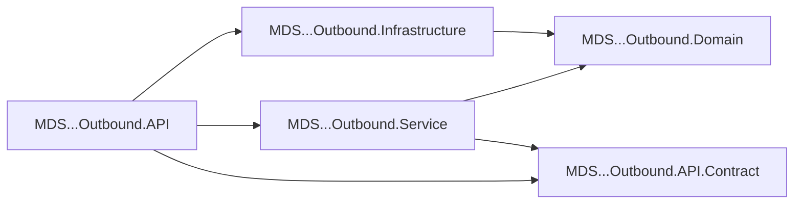

---

## 13. Notes

- Endpoint mapping is centralized in:
  - `OutboundApi`, `OutboundStreamApi`, `MetadataApi`, `DataTraceApi`, `MesapApi`, `InfoApi`
- Service registrations are centralized in:
  - API: `API/Extensions/ServiceCollectionExtensions.cs`
  - Service: `Service/Extensions/ServiceCollectionExtensions.cs`
  - Infrastructure: `Infrastructure/Extensions/ServiceRegistrationExtensions.cs`

---

## 14. Validation Flow (detailed)

Validation is executed in middleware before handlers.

Core components:
- `ValidationMiddleware`
- `RequestValidationStrategyResolver`
- Request strategies:
  - `TransactionalDataRequestValidationStrategy`
  - `GenericRequestValidationStrategy`
  - `LiteRequestValidationStrategy`
  - `MetadataRequestValidationStrategy`
  - `MetadataRangeRequestValidationStrategy`
  - `DataTraceRequestValidationStrategy`

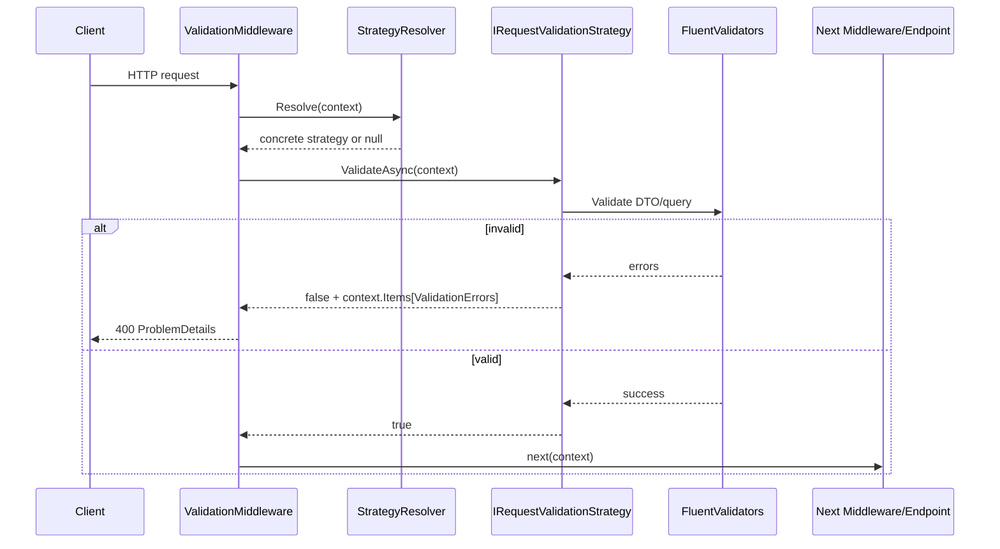

### 14.1 Generic request validation internals

`GenericRequestDetailsValidator` performs high-value checks:
- mapping existence (`MappingStorage.Load`)
- duplicates and ids validation
- shape constraints (only curves / cmdp-compatible)
- projection + aggregation validation
- filter parsing (`FilterExpressionParser.Parse`)
- mesap filter validation (`MesapMappingStorage`, `ParsedFiltersMesapValidator`)
- filter column validation (`FilterColumnsRules`, `CustomFilterValidator`)
- estimated rows validation (`DataRowsNumberValidator`)

---

## 15. Filtering and Parsing Objects + Flow

Main filtering/parsing objects:
- `FilterExpressionParser`
- `FilterExpressionVisitor`
- `FilterProvider`
- `FilterMapper`
- `RawFilter`
- `Filter`
- `FilterSet`
- `MdoLimitsRequest`
- `FilterLimits`

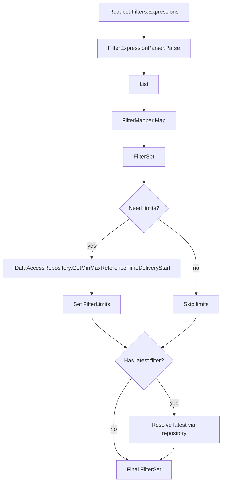

### 15.1 Where parsing is used

- Validation time:
  - `GenericRequestDetailsValidator.ParseFilters`
  - `DataRowsNumberValidator.ParseFilters`
- Command conversion/runtime:
  - `TransactionalDataCommandParser` -> `FilterProvider.GetFilters`

---

## 16. Statistics Service and Data Row Estimation Flow

Statistics objects:
- `IStatisticsService` / `StatisticsService`
- `IStatisticsRepository` / `StatisticsRepository`
- `IStatistics` implementations:
  - `TimeseriesStatistics`
  - `CurvesStatistics`
  - `SurfacesStatistics`

Row estimation entry point:
- `DataRowsNumberValidator`

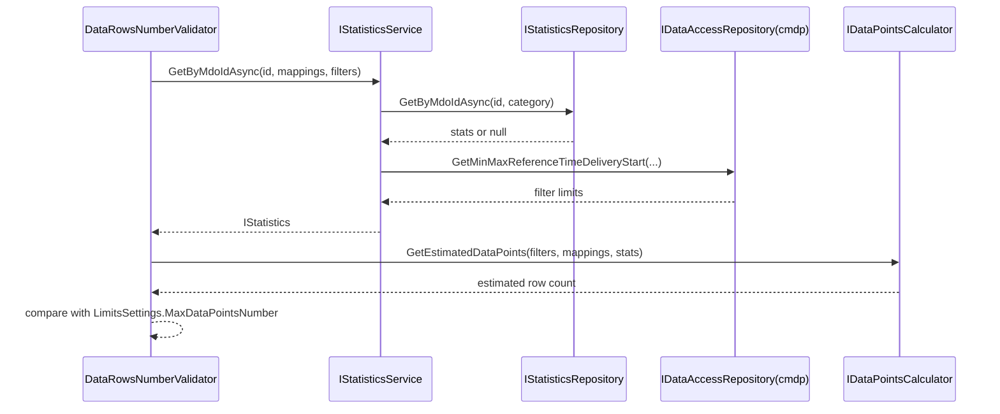

Behavior notes:
- For hyperscale MDOs, existing statistics are required.
- For CMDP/Cassandra paths, limits may be derived from repository queries.
- Surface category is excluded from row-estimation enforcement in validator logic.

---

## 17. Extended Object Connections (all major services)

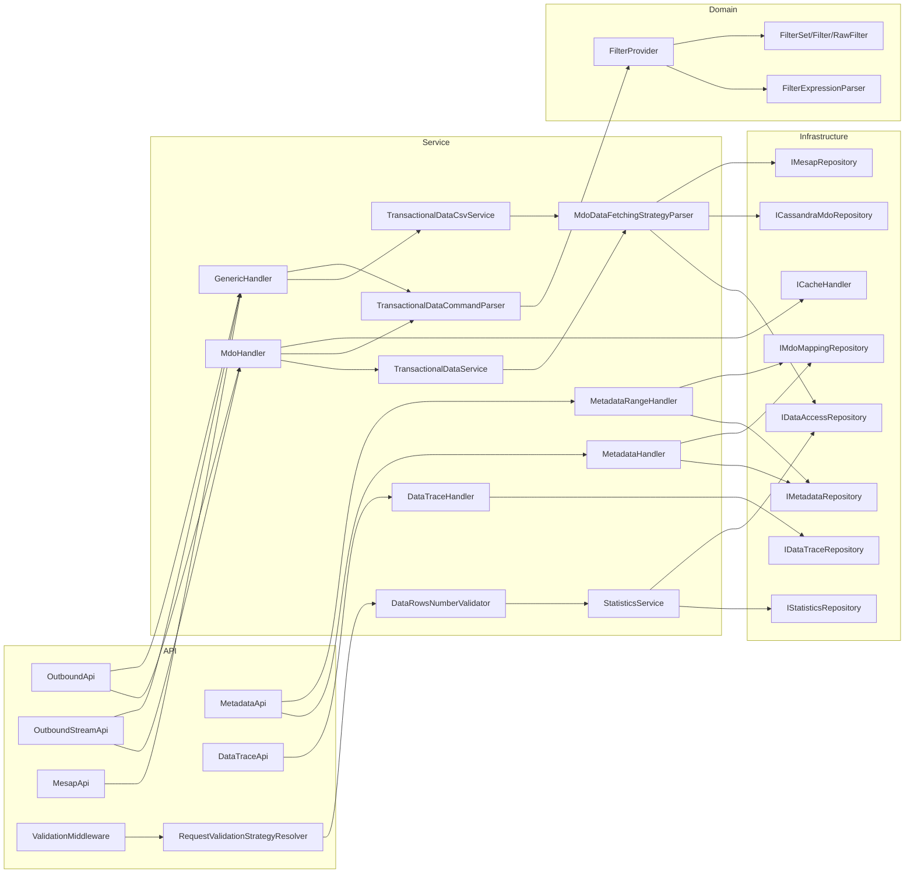

---

## 18. Parsing + Validation Connection Matrix

| Area | Main Class | Depends On | Purpose |
|---|---|---|---|
| Request strategy selection | `RequestValidationStrategyResolver` | `IEnumerable<IRequestValidationStrategy>` | Pick validator flow by route/method |
| Transactional request body validation | `TransactionalDataRequestValidationStrategy` | `IValidator<TransactionalDataRequest[]>` | Contract + business validation before endpoint |
| Generic request validation | `GenericRequestValidationStrategy` | `IValidator<GenericRequest>` | Validate generic and mesap-generic requests |
| Generic deep validation | `GenericRequestDetailsValidator` | mapping storage, mesap mapping, custom validators, row estimator | Validate ids, mappings, filters, projections, aggregations |
| Filter parsing | `FilterExpressionParser` | tokenizer + visitor | Convert expression strings into `RawFilter` objects |
| Filter mapping/runtime | `FilterProvider` + `FilterMapper` | `IDataAccessRepository`, mappings | Produce runtime `FilterSet` with defaults/latest resolution |
| Statistics lookup | `StatisticsService` | `IStatisticsRepository`, `IDataAccessRepository` | Get statistics and/or derive limits for estimation |
| Rows estimation | `DataRowsNumberValidator` | `IStatisticsService`, `IDataPointsCalculator` | Block oversized non-streaming requests |
